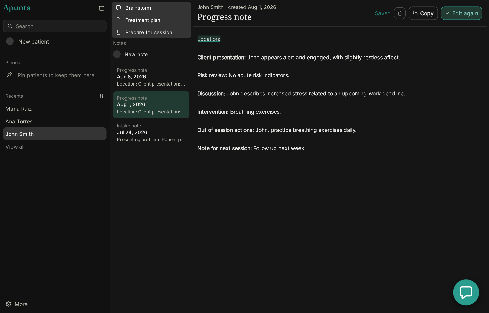
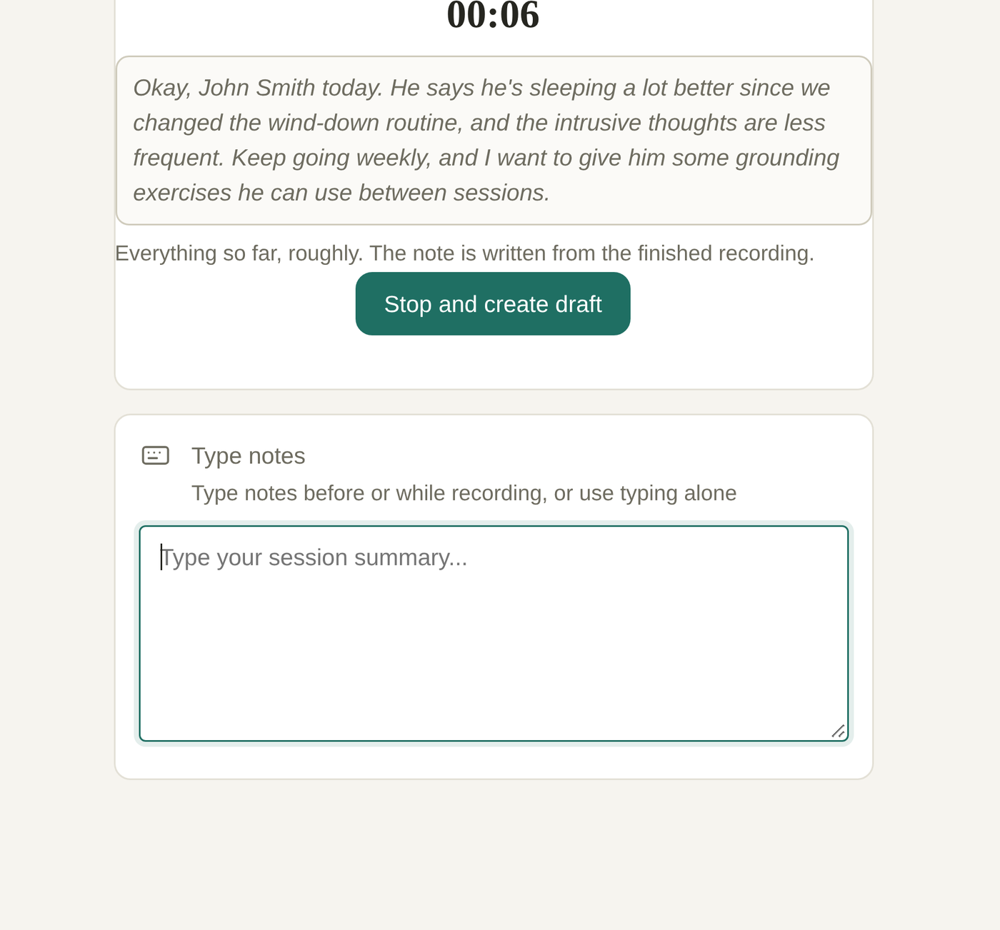
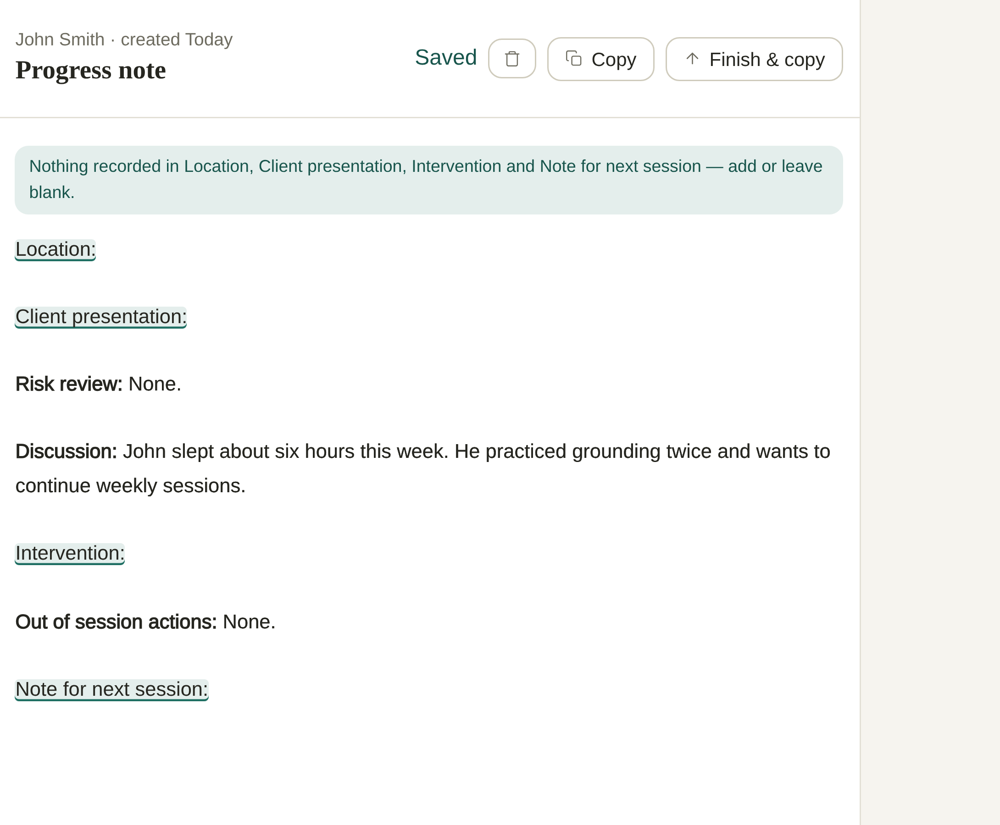
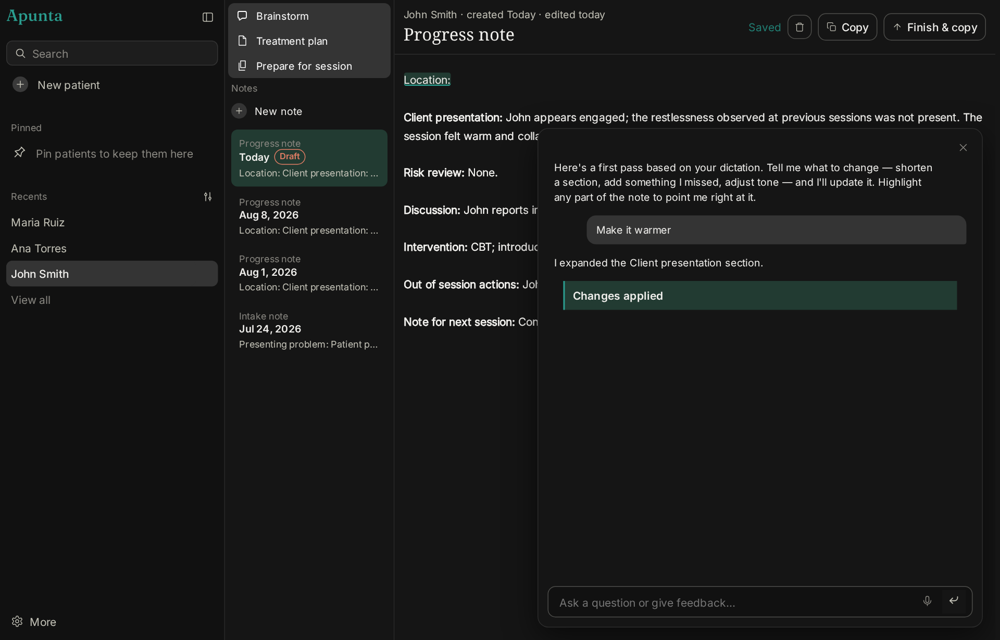
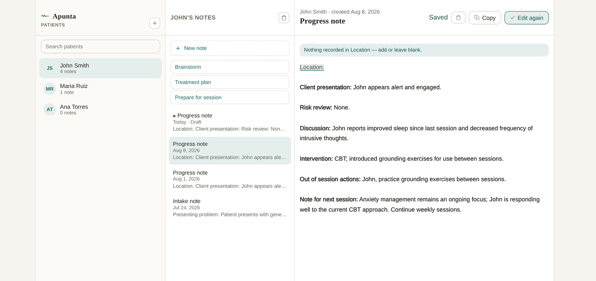
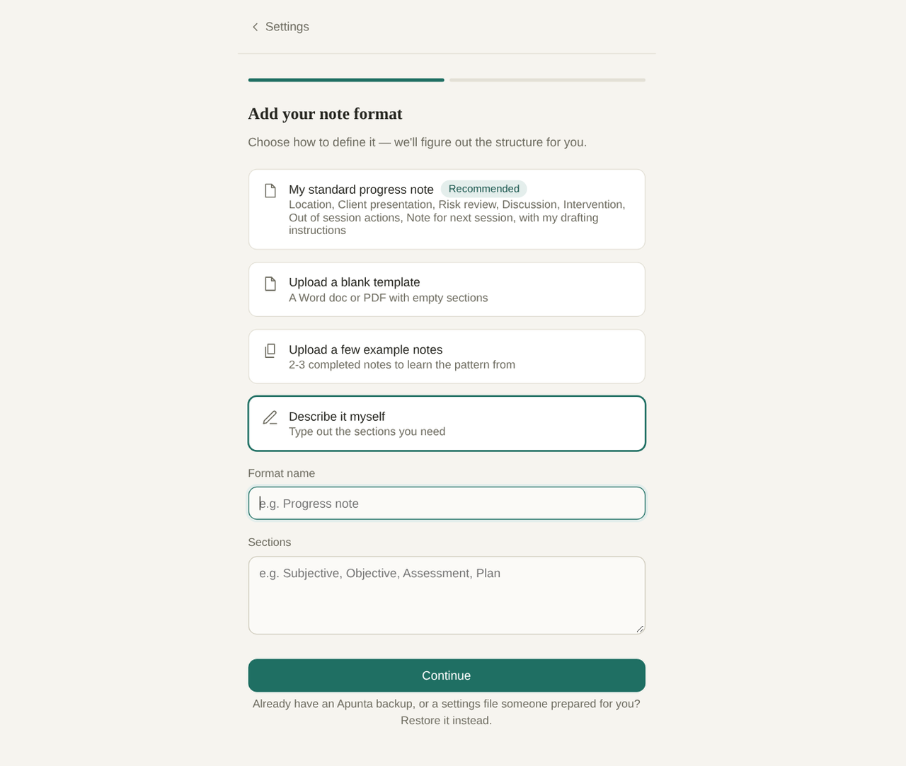

<p align="center">
  
</p>

<h1 align="center">Apunta</h1>

<p align="center">
  <strong>Local-first clinical note drafting for therapists.</strong><br>
  Dictate or type the rough version, review the draft, refine it beside the text, and use <strong>Finish &amp; copy</strong> to put the finished note into the records system you already use.
</p>

<p align="center">
  <a href="https://github.com/villenull/Apunta/actions/workflows/ci.yml"></a>
  
  
  
</p>

> **Read this as a pre-release project.** Apunta runs as a desktop app on
> Linux (an AppImage) with local AI, and its whole test suite runs in fake-AI
> mode. The macOS build is configured but has never run on a Mac: see
> [`docs/v2/MAC-FIRST-RUN.md`](docs/v2/MAC-FIRST-RUN.md).

## The short version

Apunta is a drafting tool, not a clinical record system. It keeps drafts,
transcripts and refinement conversations on your computer, then puts the note on your
clipboard when you choose **Finish & copy**. Read every draft before you use it: a local
model can still write a sentence that was never said.

<p align="center">
  
</p>

## What it feels like

<table>
<tr>
<td width="35%" valign="middle">

<p><strong>01 · Speak or type the session</strong></p>

Record a session summary or write rough notes in any order. Local `whisper.cpp`
transcription shows a live, provisional preview and turns the stopped recording
into editable source text.

</td>
<td width="65%">
  <picture>
    <source srcset="docs/assets/readme/feature-01-mobile.gif" type="image/gif" media="(prefers-reduced-motion: no-preference)">
    <source srcset="docs/assets/readme/feature-01-mobile.png" type="image/png">
    
  </picture>
</td>
</tr>
<tr>
<td width="35%" valign="middle">

<p><strong>02 · Review the draft</strong></p>

Apunta drafts into your chosen note format. Unclear speech stays marked;
sections you did not cover stay blank instead of being filled with plausible
fiction.

</td>
<td width="65%">
  <picture>
    <source srcset="docs/assets/readme/feature-02-mobile.gif" type="image/gif" media="(prefers-reduced-motion: no-preference)">
    <source srcset="docs/assets/readme/feature-02-mobile.png" type="image/png">
    
  </picture>
</td>
</tr>
<tr>
<td width="35%" valign="middle">

<p><strong>03 · Refine beside the note</strong></p>

Ask for a shorter sentence, a moved section or another concrete edit in the
chat beside the draft. The note remains yours to inspect before you finish and copy it.

</td>
<td width="65%">
  <picture>
    <source srcset="docs/assets/readme/feature-03-mobile.gif" type="image/gif" media="(prefers-reduced-motion: no-preference)">
    <source srcset="docs/assets/readme/feature-03-mobile.png" type="image/png">
    
  </picture>
</td>
</tr>
<tr>
<td width="35%" valign="middle">

<p><strong>04 · Keep patients and sessions together</strong></p>

Organize notes by patient, with treatment plans, session briefings, backups and
an optional per-patient brainstorm kept in the same local practice.

</td>
<td width="65%">
  <picture>
    <source srcset="docs/assets/readme/feature-04-mobile.gif" type="image/gif" media="(prefers-reduced-motion: no-preference)">
    <source srcset="docs/assets/readme/feature-04-mobile.png" type="image/png">
    
  </picture>
</td>
</tr>
<tr>
<td width="35%" valign="middle">

<p><strong>05 · Reuse your note formats</strong></p>

Start with the bundled progress-note format, or add your own sections from a
blank template, examples or typed names. Change formats later in Settings.

</td>
<td width="65%">
  <picture>
    <source srcset="docs/assets/readme/feature-05-mobile.gif" type="image/gif" media="(prefers-reduced-motion: no-preference)">
    <source srcset="docs/assets/readme/feature-05-mobile.png" type="image/png">
    
  </picture>
</td>
</tr>
</table>

## Privacy is a product decision

- The running app talks only to `127.0.0.1` / `localhost`.
- Writing and transcription use models stored on your computer.
- There is no account, analytics or crash reporting.
- Two network exceptions, both outside the running server and browser app:
  explicit first-run model acquisition (the installer downloads pinned model
  files from its allow-list and verifies their checksums), and the desktop
  app's update check (below).
- **Update check (desktop app only).** The check contacts `github.com` and the
  release-asset host it redirects to. It sends the request metadata any HTTPS
  request carries (IP address, TLS, user agent, and the target, architecture and
  version in the URL) and no note content, no patient data and no app-generated
  identifier. It can be turned off in Settings › About, and the app works
  offline. *(Español: la búsqueda de actualizaciones, solo en la app de
  escritorio, se conecta con `github.com` y con el servidor de archivos al que
  este redirige. Envía los metadatos que lleva cualquier solicitud HTTPS
  —dirección IP, TLS, agente de usuario y el sistema, la arquitectura y la
  versión en la URL— y ningún contenido de notas, ningún dato de pacientes ni
  ningún identificador generado por la app. Se puede desactivar en Ajustes ›
  Acerca de, y la app funciona sin conexión.)*
- Apunta has no password of its own. Lock the screen, use a separate user
  account on a shared computer, and turn on full-disk encryption (FileVault on
  a Mac, LUKS on Linux) before real notes go in.
- Backups can contain patient data. Keep them encrypted and out of
  cloud-synced folders.

See [`docs/INSTALL.md`](docs/INSTALL.md) for the plain-language limits and the
backup/restore procedure. Settings › About links to this repository, and the
licence notices live in [`THIRD-PARTY-LICENSES.md`](THIRD-PARTY-LICENSES.md).

## Getting started

### For the person using Apunta

On Linux, Apunta is a single `Apunta.AppImage`: make it executable and open
it. It needs the local AI stack (Ollama and a whisper.cpp build) set up once;
[`docs/RECOVERY.md`](docs/RECOVERY.md) walks through it on a fresh PC.

On a Mac, there is no build to download yet. The macOS app is configured
(Apple silicon, macOS 14 or newer) and
[`docs/v2/MAC-FIRST-RUN.md`](docs/v2/MAC-FIRST-RUN.md) is its first build and
run, step by step.

### For development

```sh
git clone https://github.com/villenull/Apunta.git
cd Apunta
npm install
npm run dev:fake
```

Open <http://127.0.0.1:5173>. Fake mode keeps the whole app runnable without
Ollama, whisper.cpp or any model weights. For the production-shaped local
server:

```sh
npm start
```

The source path needs Node 24.19.0. The desktop app wraps the same server in
a Tauri shell:

```sh
bash scripts/v2/package-linux-resources.sh
npm run tauri:build
```

Before real notes, run the read-only checks in
[`docs/PREFLIGHT.md`](docs/PREFLIGHT.md).

To reconstruct the exact sanitized Linux reference configuration after a
machine reset, including model digests, runtime versions, note instructions
and safe verification commands, start with
[`docs/RECOVERY.md`](docs/RECOVERY.md). It uses the existing installer and
`config/recovery/current-linux.json`; model acquisition remains an explicit
user action.

## Development status

Built: local drafting and transcription, note formats, the refine chat,
treatment plans, session briefs, a per-patient brainstorm, backups, Halaxy PDF
and Claude conversation import, English and Spanish, and the Linux desktop app
with a signed updater. After each draft, the server checks what it can verify
against the source: it puts back a risk review the draft dropped (in the
therapist's own words), removes negative findings about background that was
never gathered, rewords diagnostic labels that were never said and drops
figures that were corrected. It tells the therapist in the note's chat.
Model quality is measured with `npm run eval` on synthetic fixtures; CI's
fake-AI run proves plumbing, not clinical faithfulness.

Open: the first run on a Mac, and real-session use. Read
[`docs/HANDOFF.md`](docs/HANDOFF.md) for current work and
[`docs/decisions.md`](docs/decisions.md) for decisions that change the
product's boundaries.

## Useful commands

| Command | Purpose |
| --- | --- |
| `npm run dev:fake` | Vite + Fastify development loop without AI tooling |
| `npm run lint` | Lint, format, URL and license checks |
| `npm run typecheck` | TypeScript checks across workspaces |
| `npm test` | Unit and integration tests |
| `npm run build` | Production build |
| `npm run e2e` | Playwright against the built app in fake mode |
| `npm run eval -- --fake` | Eval harness positive-control self-check |
| `npm run tauri:build` | Build the desktop app (AppImage on Linux, .app/.dmg on a Mac) |
| `npm run check:release` | Check a release build's identity, update key and endpoint |

## Repository map

| Path | Role |
| --- | --- |
| `web/` | React + Vite browser UI |
| `server/` | Fastify API, SQLite and local AI providers |
| `shared/` | Zod schemas and types shared by server and web |
| `installer/` | First-run model download and checksum verification |
| `src-tauri/` | Tauri desktop shell and updater |
| `macos/` | The earlier Swift/AppKit shell, superseded by `src-tauri/` |
| `e2e/` | Playwright specs and synthetic evaluation fixtures |
| `docs/` | Installation, verification, decisions and handoff |

## License and status

This repository is a pre-release project and is marked `UNLICENSED` in
`package.json`: the source is visible, but no permission to redistribute the
source or packaged application is granted by this README. Do not put real patient text,
audio or exports in issues, fixtures, screenshots or commits.
