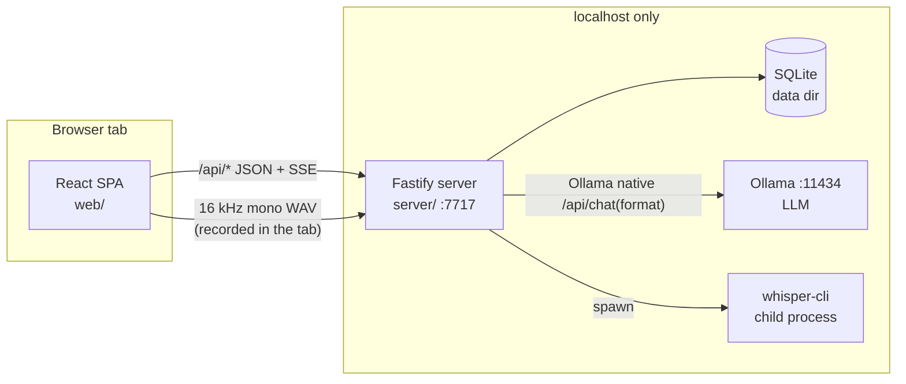

# Apunta — Master Plan

**All packets (M0–M11) are built, and the project is now in live testing.
A session picking the work up starts at `docs/HANDOFF.md`** — what is built,
what is open, and who each open item waits on — then `/CLAUDE.md`
(conventions). This plan is the design and the milestone history behind that:
read §7–8 for where the milestones landed and what was deliberately deferred.

## 1. What we are building

A local-first web app for a solo therapy practice that turns a dictated or
typed session summary into a structured clinical note. The design reference is
the click-through prototype in `prototype/` — match its look, flows, and copy
unless a packet says otherwise.

Product decisions (confirmed by the owner, 2026-08-22):

- **UI runs in a browser tab** (Chrome first; nothing Chrome-exclusive).
- **All AI runs locally and free** on the user's machine — open-weight models
  only, zero cloud calls, zero accounts, zero telemetry. This is a hard
  privacy requirement: session content is protected health information.
- **Target machine: 2024 MacBook Pro (Apple Silicon).** macOS is the primary
  platform; keep code portable (nothing macOS-only in server logic — only the
  setup script may assume macOS/Homebrew).
- **Architecture: local server + browser UI** (not in-browser inference).
  A small Node server on `127.0.0.1` serves the SPA and talks to Ollama (LLM)
  and whisper.cpp (speech-to-text) on the same machine.
- **No login in v1.** App opens straight to the workspace. Data lives in a
  local SQLite file.
- **Possible product someday:** keep a clean HTTP API boundary, UUID keys,
  and a data model that could grow tenancy — but do NOT build auth,
  multi-user, or sync now.

Research backing every stack choice: `docs/research/local-ai-stack-2026-08.md`.
Key conclusions used here: local-server 8–14B models beat in-browser 4B models
by a full quality tier on clinical drafting; Chrome's Web Speech API sends
audio to Google and is banned from this codebase; Ollama structured outputs
(JSON-schema-constrained sampling) make small models reliable at structure;
Claude skills flatten cleanly into system prompts.

## 2. Architecture



- **One repo, npm workspaces:** `server/` (Fastify + TypeScript),
  `web/` (React + Vite + TypeScript), `shared/` (zod schemas + types used by
  both), `e2e/` (Playwright).
- **Server** binds `127.0.0.1` only. In production mode it serves `web/dist`
  and the JSON API; in dev, Vite (:5173) proxies `/api` to :7717.
- **Ollama** is the LLM runtime, over its **native API** — `/api/chat`,
  `/api/tags`, `/api/show`. The app never shells out to `ollama` for
  inference; HTTP only.

  **It is not OpenAI-compatible, and this was a deliberate choice.**
  `/v1/chat/completions` strands the answer in `reasoning` on the models
  targeted here (ollama#15288), and `ChatHandler` is the only handler with
  thinking-aware `format` application (ollama#17544). An earlier version of
  this document claimed the runtime was swappable because the API was
  OpenAI-shaped; that claim was wrong and it reached M8's packet before it
  was caught. Pointing the base URL at `llama.cpp`'s `llama-server` does
  **not** work today — it is a provider rewrite, tracked as its own packet.
  See `docs/research/m8-shell-and-runtime-2026-08.md`.
- **STT** runs server-side, with **no transcoder anywhere**: the browser
  records 16 kHz mono through `new AudioContext({ sampleRate: 16000 })` and an
  `AudioWorkletNode`, writes the 44-byte RIFF header itself, and uploads that
  WAV; the server spawns `whisper-cli` (whisper.cpp, Metal) on the file as it
  arrives. whisper.cpp decodes via miniaudio now, so the ffmpeg step this plan
  originally carried is gone — along with the GPL binary M8 would have had to
  ship (`docs/research/m8-bundling-2026-08.md` §3.4). Duration comes from the
  WAV header, not `ffprobe`. `MediaRecorder` is unusable here: it emits
  webm/opus, the one container whisper.cpp cannot read. Never use the browser
  SpeechRecognition API.
- **Egress guard:** at server bootstrap, wrap `fetch` to reject any URL whose
  host is not `127.0.0.1`/`localhost`. There is no legitimate outbound
  network call at runtime. Tests assert this.

### Model defaults (Apple Silicon)

Chosen at setup based on RAM (`sysctl -n hw.memsize`), user-overridable in
Settings. Tags verified 2026-08-22 —
`docs/research/macos-setup-verification.md` carries the evidence, the
neighbouring-tag list, and a pre-ship verification script:

| RAM | Literal Ollama tag | Size | Notes |
| --- | --- | --- | --- |
| ≥ 36GB | `qwen3.6:35b-a3b` | 24GB | best quality, 256K ctx |
| 16–35GB | `gemma4:12b-it-qat` | 7.2GB | the middle tier — *not* the owner's machine |
| < 16GB | `qwen3.5:4b-q4_K_M` | 3.4GB | small-model fallback |

> ⚠️ **Never use an `-mlx` (or `-nvfp4`) tag.** Ollama's MLX engine *silently
> ignores* the `format` parameter, so JSON-schema structured output is not
> enforced at all — no error, no warning
> ([ollama#16563](https://github.com/ollama/ollama/issues/16563), open;
> [#17013](https://github.com/ollama/ollama/issues/17013)). Schema-constrained
> sampling is the load-bearing assumption of §5, and MLX is the *default*
> engine flavour on Apple Silicon, so this would fail silently on exactly the
> machine we target. GGUF tags only; the model picker must reject
> `/-(mlx|nvfp4)\b/`; and the server must always re-validate parsed output
> against the zod schema rather than trusting `format`.

Two further corrections from that verification: pin explicit tags, never
`:latest` (`gemma4:latest` resolves to E4B, not 12B), and the ≥36GB boundary
is deliberate — Metal caps usable GPU memory at ~75% of unified RAM, so a
24GB model leaves no headroom on a 32GB Mac.

STT: `whisper-large-v3-turbo` Q5_0 GGUF (~574MB) for whisper.cpp. Always pass
an `initial_prompt` built from the user's vocabulary list (Settings) —
medication and clinical terms are Whisper's known weak spot.

LLM calls: temperature 0, context request ≥ 16K (`num_ctx` — Ollama's 4096
default silently truncates), structured output enforced by JSON schema **and**
the same schema described in the prompt (the `format` parameter is invisible
to the model).

## 3. Data model

SQLite via `better-sqlite3`, migrations as numbered SQL files applied at boot.
Data dir: `~/Library/Application Support/Apunta/` (override with
`APUNTA_DATA_DIR`; tests always set it to a temp dir). UUIDv7 ids, UTC ISO
timestamps.

- `patients` — id, name, identifier (nullable), created_at, archived_at (nullable)
- `note_formats` — id, name, sections (JSON array of section names, ordered),
  instructions (TEXT — the flattened prompt for this format, see
  `docs/skill-porting.md`), source (`template|examples|manual`), created_at
- `notes` — id, patient_id, format_id, title, status (`draft|published`),
  content (TEXT — what the editor shows), created_at, updated_at,
  published_at (nullable)
- `transcripts` — id, note_id, source (`audio|typed`), raw_text,
  audio_filename (nullable), duration_seconds (nullable), created_at
- `chat_messages` — id, note_id, role (`user|assistant`), text,
  ref_quote (nullable — highlighted excerpt), created_at
- `settings` — key, value (JSON)
- `treatment_plans` — id, patient_id, version, status
  (`draft|active|superseded`), created_at, activated_at (nullable),
  review_due, review_interval_days, diagnoses (JSON — code, system,
  description, primary), presenting_problem, strengths, modality, frequency,
  discharge_criteria, effective_from / effective_to, clinician_name /
  clinician_credential / clinician_licence / clinician_npi (snapshotted from
  Settings at activation), attested_at, attestation_text,
  client_participation (`not_recorded|reviewed_with_client|declined|signed_elsewhere`)
  with its date and reason, superseded_by (nullable). Versioned: a review
  creates a new row rather than overwriting, because the plan is payer-facing
  and needs a dated revision history — which is also why the diagnosis and the
  clinician identity live on the **version** rather than on the patient, where
  a later change would silently rewrite what they were at the time (M9,
  `docs/research/m9-plan-requirements-2026-08.md` §3.1)
- `plan_goals` — id, plan_id, ordinal, statement, objectives (JSON array of
  **objects**: statement, measure, baseline, target_value, target_date,
  source), interventions (JSON), target_date (nullable), status
  (`proposed|accepted|met|discontinued`), source
  (`model_suggested|clinician_authored`), evidence (JSON — note id, note date,
  section and the verbatim excerpt), carried_from_goal_id (nullable — lineage
  across a review), created_at, accepted_at. `proposed` is a model suggestion
  and is **not** part of the plan until accepted; a CHECK constraint keeps
  `accepted_at` set exactly when it is no longer proposed. Objectives are
  objects rather than strings because measurability attaches to the objective,
  and a schema of strings cannot express a measurable one (M9)
- `session_briefs` — id, patient_id, generated_at, content (JSON — the lines,
  each with the note it came from, plus how far back it read), source_note_ids
  (JSON), saved, created_at. A row exists only when the therapist saves a
  briefing; prep is otherwise ephemeral (M9)

**Calendar dates vs instants.** `review_due`, `target_date`, `effective_from`,
`effective_to` and `client_participation_on` are **calendar dates**
(`YYYY-MM-DD`), not UTC instants: a due date stored as an instant moves by a
day depending on the reader's timezone, and this app renders dates in local
time in a browser. Everything else stays a UTC ISO timestamp.

**Note content contract:** generation and refinement always round-trip
through a sections object `{ "<Section name>": "<body>", ... }` (one required
key per format section, in format order), serialized to editor text as
`Section: body` paragraphs separated by blank lines — exactly the prototype's
note style. The user may free-edit the text; refinement sends current text
and receives a full revised sections object back.

## 4. API surface (all under `/api`)

- `GET /api/health` → `{ ok, ollama: {reachable, model, modelPresent}, whisper: {binaryPresent, modelPresent, binary, model}, fileVault: {state, detail} }` — no `ffmpeg` key: the app does not use it (M5). `fileVault` is `fdesetup status` on darwin, cached, `not_applicable` elsewhere (M7)
- `GET|POST /api/patients`, `GET|PATCH|DELETE /api/patients/:id`
- `GET /api/patients/:id/notes`, `POST /api/notes`, `GET|PATCH|DELETE /api/notes/:id`
- `POST /api/notes/:id/publish`, `POST /api/notes/:id/unpublish`
- `POST /api/generate` (body: patient_id, format_id, transcript text +
  source) → SSE stream of draft tokens, final event carries the saved note
- `POST /api/notes/:id/chat` (body: message, ref_quote?) → SSE stream:
  assistant reply tokens + optional `note-updated` event with new content
- `POST /api/transcribe` (multipart: the recorded WAV plus patient/format ids
  and any typed notes) → SSE `progress` while whisper works, then the same
  `status`/`token`/`note` stream `/api/generate` sends — one request takes a
  recording to a saved draft
- `GET|POST /api/formats`, `GET|PATCH|DELETE /api/formats/:id`
- `POST /api/formats/detect` (multipart .docx/.pdf/.txt files or body text) → `{ name, sections[] }`
- `GET|PUT /api/settings`
- `GET /api/patients/:id/plan` (+ `?version=`, `/versions`),
  `POST /api/patients/:id/plan` (start a review),
  `PATCH /api/plans/:id` (the plan-level fields, hers to type),
  `POST /api/plans/:id/activate` (puts a version in force: supersedes the
  previous one, snapshots the clinician, dates the attestation),
  `GET /api/plans/:id/export` (`text/plain` — the payer-facing document),
  `PATCH|POST|DELETE` on `/api/plans/:id/goals[/:goalId]`
- `POST /api/patients/:id/plan/suggest` → SSE stream of **proposed** goals
  with cited evidence; never writes accepted content
- `POST /api/patients/:id/prep` → SSE briefing, persisted only via
  `POST /api/patients/:id/prep/save`; `GET /api/patients/:id/prep` lists the
  briefings she kept
- `GET /api/backup` (destination, last result, archives, what the practice
  holds), `POST /api/backup` (write one now; optional `directory` and
  `passphrase`), `POST /api/backup/restore` (**stages** a restore, applied at
  the next start), `DELETE /api/backup/restore` (cancel it),
  `POST /api/backup/verified` (she tried a hand restore and it worked) — M7

Request/response shapes are zod schemas in `shared/`, used for server
validation, client types, and (for LLM outputs) JSON-schema generation.

## 5. AI pipeline

Two provider interfaces in `server/src/ai/`, each with a real and a fake
implementation, selected by env (`APUNTA_FAKE_AI=1` → fakes):

```ts
interface LlmProvider {
  generateNote(req: { instructions: string; sections: string[]; transcript: string }): AsyncIterable<LlmEvent>;
  refineNote(req: { instructions: string; sections: string[]; noteText: string; history: ChatTurn[]; message: string; refQuote?: string }): AsyncIterable<LlmEvent>;
  detectFormat(req: { kind: 'template' | 'examples' | 'manual'; text: string }): Promise<{ name: string; sections: string[] }>;
  // M9, both stages of the plan and prep paths:
  summariseNote(req: { noteText: string; sections: string[] }): Promise<LlmResult<NoteSummary>>;
  suggestPlanGoals(req: { diagnoses: string[]; modality: string; frequency: string; existingGoals: string[]; notes: SuggestNoteMaterial[] }): Promise<LlmResult<PlanSuggestion>>;
  composeBrief(req: { notes: BriefNoteMaterial[] }): Promise<LlmResult<BriefComposition>>;
}
interface SttProvider {
  transcribe(req: { wavPath: string; vocabulary: string[] }): AsyncIterable<SttEvent>; // progress + final text
}
```

- `OllamaProvider` builds the per-format JSON schema (one required string
  property per section, `additionalProperties: false`), passes it as
  structured output, restates it in the prompt, streams tokens.
- `refineNote` output schema: `{ reply: string, updatedSections: {...} | null }`
  — the model may answer a question without touching the note. The **server**
  enforces the published-lock: if the note is published, `updatedSections` is
  discarded and the canned "unlock first" reply from the prototype is used.
- **M9's two paths are two-stage, and that is a safety property rather than a
  performance one.** Ollama truncates an over-long prompt from the head, so one
  call carrying five notes would drop the instructions and keep the patient
  material. Each note is summarised in its own call (`summariseNote`), and the
  call that matters — `suggestPlanGoals` or `composeBrief` — sees only those
  small objects. Both go through the same retry ladder as everything else,
  which is what checks `prompt_eval_count` against `num_ctx` on every call.
  The lookback is a setting (`ai_lookback_notes`, default 5, hard cap 12).
- `suggestPlanGoals` **has no diagnosis field in either direction** and no way
  to state a target value or date: the diagnosis goes in as input, and a
  target is a number no note contains. It cites evidence by index into
  excerpts the server verified as literal substrings of the note, so a
  citation cannot be invented. `composeBrief` is never shown the plan, which
  is what makes "nothing connects goals to notes" structural.
- `FakeLlmProvider` / `FakeSttProvider`: deterministic, instant, keyed on
  input (e.g. transcript containing "sleep" yields the prototype's sample
  SOAP note). All CI runs use fakes; real-model runs are a manual smoke
  script. Fakes live in production code (not test helpers) so the app is
  fully demoable on any machine with `APUNTA_FAKE_AI=1`.
- Prompts are assembled in `server/src/ai/prompts.ts` from the format's
  `instructions` + section list + few-shot examples. Stateless per request.
  Snapshot-tested.

## 6. Testing strategy

| Layer | Tool | Scope | CI |
| --- | --- | --- | --- |
| Unit | Vitest | serializers, prompt builders (snapshots), schema gen, db repos, whisper arg builder | yes |
| API integration | Vitest + fastify.inject | every endpoint against real SQLite (temp dir) + fake providers; egress guard; published-lock semantics | yes |
| E2E | Playwright (Chromium) | full user flows in fake-AI mode: first-run → format onboarding → add patient → typed note → draft → refine → publish → copy; audio flow via Chromium fake mic (`--use-fake-device-for-media-capture`, `--use-file-for-fake-audio-capture` with a checked-in WAV) | yes |
| Live smoke | script (`npm run smoke:live`) | real Ollama + whisper on the dev Mac: transcribe fixture WAV, draft a note, assert schema-valid + all sections present | manual |
| Quality eval | script (`npm run eval`) | 20 fixture transcripts x N runs through the real model, scored against `e2e/fixtures/eval/rubric.md`. The report leads with **fabrication rate**; a blank section is correct output, not an empty-section failure | manual (`-- --fake` in CI, as the scorer's own positive control) |

CI is GitHub Actions on ubuntu-latest (fake providers make Linux fine):
lint → typecheck → unit+integration → build → Playwright. All must pass
before a packet is done.

## 7. Milestones

Dependency order — each is one work packet in `docs/agents/`:

```
M0 scaffold → M1 data+API → M2 web shell → M3 AI providers ─┬→ M4 refine chat
                                                            ├→ M5 audio capture
                                                            └→ M6 format onboarding
M4+M5+M6 → M7 setup, polish & eval → M8 double-clickable installer
M3+M4 → M9 treatment plan & session prep (independent of M5/M6)
```

M4, M5 and M6 each depend only on M3, so they may be tackled in any order
among themselves — but **packets run strictly one at a time**. All work lands
on a single shared branch (`claude/local-browser-app-planning-0likfi`) with no
feature branches and no inter-packet pull requests, so two agents working
concurrently would collide in the same working tree. See
`docs/agents/README.md` for the branch workflow.

| # | Packet | One-line outcome |
| --- | --- | --- |
| M0 | `M0-scaffold.md` | Monorepo, toolchain, CI, empty server+SPA, all harnesses green |
| M1 | `M1-data-api.md` | SQLite schema + full CRUD API, integration-tested |
| M2 | `M2-web-shell.md` | Prototype UI ported to React against the real API (no AI yet) |
| M3 | `M3-ai-providers.md` | Provider layer, fakes, Ollama drafting with structured output, typed-note → draft flow |
| M4 | `M4-refine-chat.md` | Streaming refine chat with highlight-refs, quick actions, publish-lock |
| M5 | `M5-audio.md` | Record 16 kHz WAV in the tab → upload → whisper.cpp → transcript → draft |
| M6 | `M6-formats.md` | Format onboarding (template/examples/manual), detection, editor, skill import |
| M7 | `M7-packaging.md` | macOS setup script, first-run wizard, model auto-pick, export, polish, eval harness |
| M8 | `M8-installer.md` | Double-clickable `.dmg` — bundled runtimes, first-run download UI, signing, non-technical install guide |
| M9 | `M9-treatment-plan.md` | Versioned treatment plan (model-suggested, therapist-owned) + on-demand session prep briefings |

**M7 vs M8.** M7 makes the app work on a developer's Mac via a setup script.
M8 makes it installable by someone who has never opened a terminal: no
Homebrew, no Node, no git clone, no Ollama install — one download, one drag,
one progress bar. M8 bundles **the runtime the app actually speaks** — Ollama.

An earlier version of this paragraph said M8 bundles `llama-server`, "which is
why PLAN §2 insists the app only ever speak the OpenAI-compatible API." That
reasoning ran in a circle: the wish to bundle `llama-server` produced the §2
constraint, and the §2 constraint was then cited as the justification for
bundling `llama-server`. Neither end was ever checked against the code, which
has spoken Ollama's native API since M3. Replacing the runtime is a provider
rewrite and has its own packet.

M8 cannot be built or verified in CI (it needs macOS), so its final acceptance
is a manual run on the owner's Mac.

## 8. Deferred (do not build now)

- Passcode + at-rest encryption (SQLCipher) — backlog, design allows it.
  Deferred deliberately, not by omission: the app has no login, so the key
  would sit on the same disk protected by the same login password FileVault
  already uses. Bundling passcode and SQLCipher into one item is correct —
  a passcode without SQLCipher is a UI gate over a plaintext file, and
  SQLCipher without a passcode is a lock with the key taped to it. The most
  likely harm from shipping it early is not an attacker getting in but a solo
  practitioner losing a Keychain-held key and being locked out of years of
  history. v1 spends the effort on *verifying* FileVault instead, and on
  encrypting backups once they leave the machine. See
  `docs/research/data-at-rest-2026-08.md`.
- In-browser WebLLM/whisper fallback engine — provider interface allows it.
- Optional Claude API provider (paid, higher quality) — same interface.
- Multi-user/auth/sync/hosted mode.
- Windows/Linux setup scripts (server code stays portable regardless).
