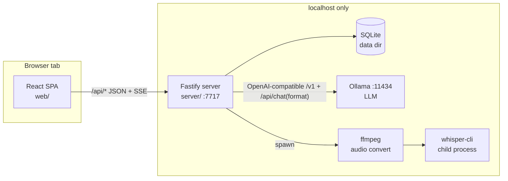

# Practice Notes — Master Plan

**Read this first.** Every coding agent working on this repo starts here, then
reads `/CLAUDE.md` (conventions) and its own work packet in `docs/agents/`.

## 1. What we are building

A local-first web app for a solo therapy practice that turns a dictated or
typed session summary into a structured clinical note. The design reference is
the click-through prototype in `prototype/` — match its look, flows, and copy
unless a packet says otherwise.

Product decisions (confirmed by the owner, 2026-08-22):

- **UI runs in a browser tab** (Chrome first; nothing Chrome-exclusive).
- **All AI runs locally and free** on the user's machine — open-weight models
  only, zero cloud calls, zero accounts, zero telemetry. This is a hard
  privacy requirement: session content is protected health information.
- **Target machine: 2024 MacBook Pro (Apple Silicon).** macOS is the primary
  platform; keep code portable (nothing macOS-only in server logic — only the
  setup script may assume macOS/Homebrew).
- **Architecture: local server + browser UI** (not in-browser inference).
  A small Node server on `127.0.0.1` serves the SPA and talks to Ollama (LLM)
  and whisper.cpp (speech-to-text) on the same machine.
- **No login in v1.** App opens straight to the workspace. Data lives in a
  local SQLite file.
- **Possible product someday:** keep a clean HTTP API boundary, UUID keys,
  and a data model that could grow tenancy — but do NOT build auth,
  multi-user, or sync now.

Research backing every stack choice: `docs/research/local-ai-stack-2026-08.md`.
Key conclusions used here: local-server 8–14B models beat in-browser 4B models
by a full quality tier on clinical drafting; Chrome's Web Speech API sends
audio to Google and is banned from this codebase; Ollama structured outputs
(JSON-schema-constrained sampling) make small models reliable at structure;
Claude skills flatten cleanly into system prompts.

## 2. Architecture



- **One repo, npm workspaces:** `server/` (Fastify + TypeScript),
  `web/` (React + Vite + TypeScript), `shared/` (zod schemas + types used by
  both), `e2e/` (Playwright).
- **Server** binds `127.0.0.1` only. In production mode it serves `web/dist`
  and the JSON API; in dev, Vite (:5173) proxies `/api` to :7717.
- **Ollama** is the default LLM runtime (OpenAI-compatible API). The app
  never shells out to `ollama` for inference — HTTP only — but may use it to
  list/pull models. llama.cpp `llama-server` must also work by pointing the
  base URL at it (same API shape); don't depend on Ollama-only quirks except
  the documented `format` parameter path, which has an OpenAI-compatible
  `response_format: {type: "json_schema"}` equivalent.
- **STT** runs server-side: browser records with MediaRecorder → uploads →
  ffmpeg converts to 16kHz WAV → `whisper-cli` (whisper.cpp, Metal)
  transcribes. Never use the browser SpeechRecognition API.
- **Egress guard:** at server bootstrap, wrap `fetch` to reject any URL whose
  host is not `127.0.0.1`/`localhost`. There is no legitimate outbound
  network call at runtime. Tests assert this.

### Model defaults (Apple Silicon)

Chosen at setup based on RAM (`sysctl -n hw.memsize`), user-overridable in
Settings. Tags verified 2026-08-22 —
`docs/research/macos-setup-verification.md` carries the evidence, the
neighbouring-tag list, and a pre-ship verification script:

| RAM | Literal Ollama tag | Size | Notes |
| --- | --- | --- | --- |
| ≥ 36GB | `qwen3.6:35b-a3b` | 24GB | best quality, 256K ctx |
| 16–35GB | `gemma4:12b-it-qat` | 7.2GB | **the default on the target Mac** |
| < 16GB | `qwen3.5:4b-q4_K_M` | 3.4GB | small-model fallback |

> ⚠️ **Never use an `-mlx` (or `-nvfp4`) tag.** Ollama's MLX engine *silently
> ignores* the `format` parameter, so JSON-schema structured output is not
> enforced at all — no error, no warning
> ([ollama#16563](https://github.com/ollama/ollama/issues/16563), open;
> [#17013](https://github.com/ollama/ollama/issues/17013)). Schema-constrained
> sampling is the load-bearing assumption of §5, and MLX is the *default*
> engine flavour on Apple Silicon, so this would fail silently on exactly the
> machine we target. GGUF tags only; the model picker must reject
> `/-(mlx|nvfp4)\b/`; and the server must always re-validate parsed output
> against the zod schema rather than trusting `format`.

Two further corrections from that verification: pin explicit tags, never
`:latest` (`gemma4:latest` resolves to E4B, not 12B), and the ≥36GB boundary
is deliberate — Metal caps usable GPU memory at ~75% of unified RAM, so a
24GB model leaves no headroom on a 32GB Mac.

STT: `whisper-large-v3-turbo` Q5_0 GGUF (~574MB) for whisper.cpp. Always pass
an `initial_prompt` built from the user's vocabulary list (Settings) —
medication and clinical terms are Whisper's known weak spot.

LLM calls: temperature 0, context request ≥ 16K (`num_ctx` — Ollama's 4096
default silently truncates), structured output enforced by JSON schema **and**
the same schema described in the prompt (the `format` parameter is invisible
to the model).

## 3. Data model

SQLite via `better-sqlite3`, migrations as numbered SQL files applied at boot.
Data dir: `~/Library/Application Support/Practice Notes/` (override with
`PATIENCE_DATA_DIR`; tests always set it to a temp dir). UUIDv7 ids, UTC ISO
timestamps.

- `patients` — id, name, identifier (nullable), created_at, archived_at (nullable)
- `note_formats` — id, name, sections (JSON array of section names, ordered),
  instructions (TEXT — the flattened prompt for this format, see
  `docs/skill-porting.md`), source (`template|examples|manual`), created_at
- `notes` — id, patient_id, format_id, title, status (`draft|published`),
  content (TEXT — what the editor shows), created_at, updated_at,
  published_at (nullable)
- `transcripts` — id, note_id, source (`audio|typed`), raw_text,
  audio_filename (nullable), duration_seconds (nullable), created_at
- `chat_messages` — id, note_id, role (`user|assistant`), text,
  ref_quote (nullable — highlighted excerpt), created_at
- `settings` — key, value (JSON)

**Note content contract:** generation and refinement always round-trip
through a sections object `{ "<Section name>": "<body>", ... }` (one required
key per format section, in format order), serialized to editor text as
`Section: body` paragraphs separated by blank lines — exactly the prototype's
note style. The user may free-edit the text; refinement sends current text
and receives a full revised sections object back.

## 4. API surface (all under `/api`)

- `GET /api/health` → `{ ok, ollama: {reachable, model, modelPresent}, whisper: {binaryPresent, modelPresent}, ffmpeg: {present} }`
- `GET|POST /api/patients`, `GET|PATCH|DELETE /api/patients/:id`
- `GET /api/patients/:id/notes`, `POST /api/notes`, `GET|PATCH|DELETE /api/notes/:id`
- `POST /api/notes/:id/publish`, `POST /api/notes/:id/unpublish`
- `POST /api/generate` (body: patient_id, format_id, transcript text +
  source) → SSE stream of draft tokens, final event carries the saved note
- `POST /api/notes/:id/chat` (body: message, ref_quote?) → SSE stream:
  assistant reply tokens + optional `note-updated` event with new content
- `POST /api/transcribe` (multipart audio) → SSE progress → final transcript
- `GET|POST /api/formats`, `GET|PATCH|DELETE /api/formats/:id`
- `POST /api/formats/detect` (multipart .docx/.pdf/.txt files or body text) → `{ name, sections[] }`
- `GET|PUT /api/settings`

Request/response shapes are zod schemas in `shared/`, used for server
validation, client types, and (for LLM outputs) JSON-schema generation.

## 5. AI pipeline

Two provider interfaces in `server/src/ai/`, each with a real and a fake
implementation, selected by env (`PATIENCE_FAKE_AI=1` → fakes):

```ts
interface LlmProvider {
  generateNote(req: { instructions: string; sections: string[]; transcript: string }): AsyncIterable<LlmEvent>;
  refineNote(req: { instructions: string; sections: string[]; noteText: string; history: ChatTurn[]; message: string; refQuote?: string }): AsyncIterable<LlmEvent>;
  detectFormat(req: { kind: 'template' | 'examples' | 'manual'; text: string }): Promise<{ name: string; sections: string[] }>;
}
interface SttProvider {
  transcribe(req: { wavPath: string; vocabulary: string[] }): AsyncIterable<SttEvent>; // progress + final text
}
```

- `OllamaProvider` builds the per-format JSON schema (one required string
  property per section, `additionalProperties: false`), passes it as
  structured output, restates it in the prompt, streams tokens.
- `refineNote` output schema: `{ reply: string, updatedSections: {...} | null }`
  — the model may answer a question without touching the note. The **server**
  enforces the published-lock: if the note is published, `updatedSections` is
  discarded and the canned "unlock first" reply from the prototype is used.
- `FakeLlmProvider` / `FakeSttProvider`: deterministic, instant, keyed on
  input (e.g. transcript containing "sleep" yields the prototype's sample
  SOAP note). All CI runs use fakes; real-model runs are a manual smoke
  script. Fakes live in production code (not test helpers) so the app is
  fully demoable on any machine with `PATIENCE_FAKE_AI=1`.
- Prompts are assembled in `server/src/ai/prompts.ts` from the format's
  `instructions` + section list + few-shot examples. Stateless per request.
  Snapshot-tested.

## 6. Testing strategy

| Layer | Tool | Scope | CI |
| --- | --- | --- | --- |
| Unit | Vitest | serializers, prompt builders (snapshots), schema gen, db repos, whisper arg builder | yes |
| API integration | Vitest + fastify.inject | every endpoint against real SQLite (temp dir) + fake providers; egress guard; published-lock semantics | yes |
| E2E | Playwright (Chromium) | full user flows in fake-AI mode: first-run → format onboarding → add patient → typed note → draft → refine → publish → copy; audio flow via Chromium fake mic (`--use-fake-device-for-media-capture`, `--use-file-for-fake-audio-capture` with a checked-in WAV) | yes |
| Live smoke | script (`npm run smoke:live`) | real Ollama + whisper on the dev Mac: transcribe fixture WAV, draft a note, assert schema-valid + all sections present | manual |
| Quality eval | script (`npm run eval`) | M7: N fixture transcripts through the real model; structural fidelity checks (all sections, no empty sections, no fabricated quotes) per candidate model | manual |

CI is GitHub Actions on ubuntu-latest (fake providers make Linux fine):
lint → typecheck → unit+integration → build → Playwright. All must pass
before a packet is done.

## 7. Milestones

Dependency order — each is one work packet in `docs/agents/`:

```
M0 scaffold → M1 data+API → M2 web shell → M3 AI providers ─┬→ M4 refine chat
                                                            ├→ M5 audio capture
                                                            └→ M6 format onboarding
M4+M5+M6 → M7 setup, polish & eval → M8 double-clickable installer
```

M4, M5 and M6 each depend only on M3, so they may be tackled in any order
among themselves — but **packets run strictly one at a time**. All work lands
on a single shared branch (`claude/local-browser-app-planning-0likfi`) with no
feature branches and no inter-packet pull requests, so two agents working
concurrently would collide in the same working tree. See
`docs/agents/README.md` for the branch workflow.

| # | Packet | One-line outcome |
| --- | --- | --- |
| M0 | `M0-scaffold.md` | Monorepo, toolchain, CI, empty server+SPA, all harnesses green |
| M1 | `M1-data-api.md` | SQLite schema + full CRUD API, integration-tested |
| M2 | `M2-web-shell.md` | Prototype UI ported to React against the real API (no AI yet) |
| M3 | `M3-ai-providers.md` | Provider layer, fakes, Ollama drafting with structured output, typed-note → draft flow |
| M4 | `M4-refine-chat.md` | Streaming refine chat with highlight-refs, quick actions, publish-lock |
| M5 | `M5-audio.md` | Record → upload → ffmpeg → whisper.cpp → transcript → draft |
| M6 | `M6-formats.md` | Format onboarding (template/examples/manual), detection, editor, skill import |
| M7 | `M7-packaging.md` | macOS setup script, first-run wizard, model auto-pick, export, polish, eval harness |
| M8 | `M8-installer.md` | Double-clickable `.dmg` — bundled runtimes, first-run download UI, signing, non-technical install guide |

**M7 vs M8.** M7 makes the app work on a developer's Mac via a setup script.
M8 makes it installable by someone who has never opened a terminal: no
Homebrew, no Node, no git clone, no Ollama install — one download, one drag,
one progress bar. M8 bundles `llama-server` (llama.cpp) rather than requiring
Ollama, which is why PLAN §2 insists the app only ever speak the
OpenAI-compatible API. M8 cannot be built or verified in CI (it needs macOS),
so its final acceptance is a manual run on the owner's Mac.

## 8. Deferred (do not build now)

- Passcode + at-rest encryption (SQLCipher) — backlog, design allows it.
- In-browser WebLLM/whisper fallback engine — provider interface allows it.
- Optional Claude API provider (paid, higher quality) — same interface.
- Multi-user/auth/sync/hosted mode.
- Windows/Linux setup scripts (server code stays portable regardless).
